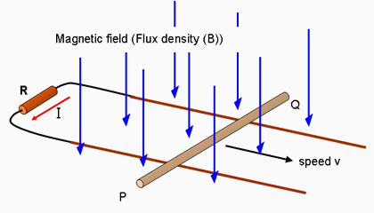

#Kinematics/General Physics
### KGP1 - Why is $c$/$\hbar$/$k_B$/(other fundamental constant) the value it is? What would happen if it was different?

Why is $c$ (the speed of light in a vacuum) exactly $299 \, 792 \, 458 \; \mathrm{m} / \mathrm{s}$?

The metre and the second are arbitrary units that originally referred in their definition to natural phenomena that were relevant to the daily life of humans. A second would be $1/86400$ of a day, the period of rotation of the Earth. The metre is one ten-millionth of the distance between the equator and the North Pole.

As soon as the necessary physics was consolidated, these definitions were replaced with the modern ones:

1) The second is $9\,192\,631\,770$ times the period of the radiation emitted in a specific atomic transition of ${}^{133}$Cs.

2) The metre is the length travelled by light in vacuum in $1/299 \, 792 \, 458$ of a second.

The first definition is still referring to a natural process, albeit much more exact than the rotation of the Earth. The bizzarre number involved is to make sure the new definition makes a modern second as similar as possible to the older second. Basically, the period of the transition radiation had been previously *measured* as being $1/9192631770 \, \mathrm{s}$ (in older seconds).

The second one rests on the first and simultaneously fixes the value of $c$. The units are explicitly *designed* so that the value of $c$ is $299\,792\,458$. This value is similar to the previous, measured value of $c$ in the older units.

Instead, the value of $c$ in the new system is defined, not measured.

This means we can actually make $c$ have any value we want by redefining the units. If we use lightyears and years for measuring lengths and times, we get

$$ c = 1 \; \mathrm{ly}/\mathrm{y} $$

But here it seems like we're just playing around with units. We aren't apparently actually *changing the speed of light*. Here's a little gedankenexperiment about that.

Assume there was a Universe where the speed of light was twice ours:

$$ c' = 2 c $$

Since the speed of light enters basically every relativistic phenomenon and many things about light and electromagnetism, you can bet the dynamics in this primed Universe will be very different from those in our unprimed one. For example, it's very likely it won't develop human life, at least in the same way as it happened for us.

However.

Consider the following change of variables in the primed Universe:

$$ x' \rightarrow \tilde{x}' = x'/2, \quad t' \rightarrow \tilde{t}' = t'$$

The tilded coordinates are just the normal coordinates, but with space stretched by a factor of 2. In these coordinates, the value of the speed of light is:

$$ \tilde{c} = \left(\frac{\tilde{x}'}{\tilde{t}'} \right)_\text{computed for a light ray} = \frac{1}{2}\frac{x'}{t'} = \frac{1}{2} c' = c $$

So we have to admit that, in the tilded coordinates, the speed of light is back to its original value in our Universe. In those coordinates, the primed Universe satisfies the same equations of motion as our own, and evolves identically. It has the same Big Bang, the same primordial nucleosynthesis, the same star formation, a Sun identical to ours, and an Earth and humans.

The humans are twice as tall as us, yes. But they don't know that. Since their Earth is twice as big, their metre (the tilded metre) is twice ours, and they measure their height to be normal in their tilded metres.

They finally measure the speed of light to be $299\,792\,458$ metres per second.

So, nothing would happen. This is the manifestation of how fundamentally meaningless the value of the speed of light is. Mainly because there is no independent other speed with which to compare it, as all speeds in physics ultimately depend on it.

All of the above applies to the following set of independent fundamental physical constants:

$c$, $\hbar$, $k_B$, $\epsilon_0$, $G$

and all those auxiliary constants formed by products of powers of those above. The above set is a maximal set of independent constants and is the largest set of constant for which you can simultaneously impose a fixed value by redefining the units. If you fix less than all of these, you get freedom in your system of units. For example, setting

$c = \hbar = k_B = \epsilon_0 = 1$

gives natural units (Lorentz-Heaviside variant), useful in high-energy physics. Since you omitted $G$, you still have a single arbitrary unit to fix. You can use the metre, for example, and the rest of the units follow. The time unit is $c\mathrm{m}$, the energy unit is $\frac{c\hbar}{\mathrm{m}}$ and so on.

Adding $G=1$ instead gives Planck units.

#Classical Mechanics
### CM1 - Why is my physics teacher so anal about centripetal vs centrifugal? Is the centrifugal force "fictitious"? 

This one is an *extremely heated* question, and this baffles me because it has no reason to be so. Still, be wary that whatever your opinion, people will invariably shout at you. With that said, let's start.

Let's consider an object in uniform circular motion. This means we are in an inertial reference frame (say, laboratory, or $K$) and we force an object of mass $m$ to follow a circular trajectory of radius $R$ with constant speed $v$. We are interested in finding the acceleration of the object. 

Let me rapidly review how one could compute such an acceleration. I'm gonna do it very very quickly using trigonometry, but most textbooks take more time and calculate $\vec a$ using a mostly "geometric" approach coherent with Newtonian tradition, so refer to them if you want a simpler proof. Here I'm interested more in dealing with it and moving on to the interesting conceptual question. So, in coordinates, with $xy$ the plane of rotation and $z$ the axis of rotation:

$$ \vec r = R \begin{pmatrix} \cos(\omega t) \\ \sin(\omega t) \\ 0 \end{pmatrix} $$

Where $\omega := v/R$ is the angular velocity. Then differentiating:

$$ \vec v = \frac{d}{dt} \vec r = \omega R \begin{pmatrix} - \sin(\omega t) \\ \cos(\omega t) \\ 0 \end{pmatrix} $$

Note that the norm of $\vec v$ is $\omega R = v$ which justifies the definition of $\omega$. And differentiating again:

$$ \vec a = R \omega^2 \begin{pmatrix} -\cos(\omega t) \\ -\sin(\omega t) \\ 0 \end{pmatrix} = - \omega^2 \vec r $$

so we have a purely radial acceleration pointing *inwards*, so a centripetal acceleration.

Centripetal (not centripe**d**al) and centrifugal are both words created by Sir Isaac himself back in 1687, who wrote in Latin. The first part of the word comes from *centrum*, "centre" (itself from Greek *κέντρον* meaning "sharp point"). -petal is from *petō*, meaning to beg, to seek. -fugal is from *fugiō*, meaning to flee. They're pretty self-explanatory when presented this way.

So we have a centripetal acceleration and consequently, if Newton's second law is to be trusted, then

$$ \vec F = m \vec a$$

there must be a centripetal force. So to keep an object in circular uniform motion, a centripetal force pulling it towards the centre is necessary.

In fact, to keep the mass in circular motion we've needed exactly a force pushing *radially inwards*. If we use a rope, the tension of the rope is the centripetal force that keeps the mass in circular motion.

So far, no trace of the centrifugal force, and that's ok.

But now, let's move to the corotating frame $K'$. The corotating frame rotates along with the mass and the rope; in this frame the mass and rope are immobile, and the rest of the lab rotates around them. The position of the mass is fixed at:

$$ \vec r' = R \begin{pmatrix} 1 \\ 0 \\ 0 \end{pmatrix} $$

and the velocity $\vec v' = \frac{d}{dt} r' = 0$ and $\vec a' = 0$. So, if Newton's law held, we would have

$$\vec F' = 0$$

but we already knew the only force acting on the mass in the centripetal tension of the rope, which is definitely nonzero, so this makes very little sense.

The point is that the corotating frame is non inertial. An inertial frame is one where Newton's second law is true. Instead in a noninertial frame the difference between the forces applied and those needed for mantaining that motion is nonzero:

$$m \vec a' - \vec F' =: \vec F_\text{in}$$

$F_\text{in}$ are the so-called *inertial forces*, since they might as well be thought to be forces acting exclusively because we've moved to a non-inertial frame. The advantage of seeing these as forces is that we can restore Newton's second law by adding them together with the "physical" forces:

$$ (\vec F' + \vec F_\text{in} ) = m \vec a' $$

which is pretty remarkable. In our case, $\vec a' = 0$, so

$$\vec F_\text{in} = - \vec F_\text{tension}$$

so the inertial force points radially outwards, and is therefore a *centrifugal* force.

Why do, mathematically, inertial forces arise?

Consider a change of coordinates on space from frame $K$ to the corotating frame $K'$. This is in general given by a function $\vec r' = \xi(\vec r;t)$, where I've explicitated that our change of coordinates might depend on time. Now one typically in Newtonian mechanics works with *affine* coordinate changes, of the form:

$$\vec r' = \Omega(t) \vec r + \vec b(t)$$

where $\Omega(t)$ is a matrix and both $\Omega(t)$ and $\vec b(t)$ depend on time. The acceleration in $K'$ is therefore

$$v' = \dot {\vec r} = \dot {\Omega} \vec r + \Omega \dot {\vec r} + \dot {\vec b}$$

$$a' = \dot{\vec v} = \ddot {\Omega} \vec r + 2 \dot {\Omega} \vec v + \Omega \vec a + \ddot {\vec b}$$

where I've made use of Newton's own dot notation for time derivatives. Note that *if* $\Omega$ and $\vec b$ were *constant* in time, we would have

$$\vec v'_0 = \Omega \vec v$$
$$\vec a'_0 = \Omega \vec a$$

which is interesting. It means, for example, that if you change between frames of reference that are rotated between eachother by a constant angle (i.e.: $\Omega$ is a constant rotation matrix) then your new $v$ and $a$ will be the the old ones rotated by the same angle. Instead, in the general case where $\Omega(t)$ and $\vec b(t)$ are time-dependent, we get

$$\vec a' = \vec a'_0 + \ddot{\Omega} \vec r + 2 \dot {\Omega} \vec v + \ddot{\vec b}$$

That is: the fact that the parameters that describe the change of coordinates in space depend on time *implies* that accelerations will be augmented by additional, "spurious" terms due to the variation in time of said parameters. We switch to forces by multiplying by $m$:

$$m \vec a' = \vec F' + m \left( \ddot {\Omega} \vec r + 2 \dot{ \Omega} \vec v + \ddot {\vec b}\right)$$

$$=: \vec F' + \vec F_\text{in}\left(\vec r',\vec v'\right)$$

So, I've identified $m \vec a'_0$ as the total "physical" force, that is the transformed version ($\vec F' = \Omega \vec F$) of the forces already present in $K$ (such as the centripetal force). But in addition to that we have all those other terms, which I've grouped together in the total inertial force $\vec F_\text{in}$. I've written the inertial force as a function of the new position and velocity $\vec r'$ and $\vec v'$, when the expressions above are in terms of $\vec r$ and $\vec v$, but notice that it's easy to invert the $\vec r'(\vec r)$ and $\vec v'(\vec v)$ relationships and get $\vec r(\vec r')$ and $\vec v(\vec v')$.

So Newton's law does not hold with $\vec F'$ as the total force. But we have no theorem that says that $\vec F'$ should be identified as the total force. So we have two entirely equivalent possibilities:

- Newton's law does not hold in non-inertial frames. $\vec F'$ are definitely the forces acting in $K'$, while $\vec F_\text{in}$ are an artefact of the non-inertiality. Therefore they are "fictitious" forces.
- Newton's law *does* continue to hold in non-inertial frames, but forces do not transform trivially between frames (i.e.: $\vec F' \neq \Omega \vec F$). In particular, when switching to non-inertial frames, multiple additional terms appear. The total force acting on $K'$ then is the sum of the naive transform of the original force plus inertial forces. So inertial forces are absolutely real effects.

Now, to the point where we've gotten so far, both seem absolutely equivalent viewpoints in terms of physics (which is just concerned about measurement results) and the question seem exquisitely philosophical. In light of this, why do people spend so much energy striving to prove the inherent superiority of the first version, the "fictitious" one? I'm talking about adages like

> inertial forces are fake forces, they are "an illusion"

or even this

> "centrifugal" force? Maybe you mean *centripetal*. The centrifugal force does not exist.

as if the centrifugal force suddenly became taboo. The answer is I don't know: I don't know why people do this. Wikipedia's article is literally named Fictitious Force, and this view was also very likely that of Newton.

Inertial forces are actually pretty real. If I'm riding a merry-go-round, I can measure a force pushing me outwards. If I weigh myself at the equator, I weigh slightly less than at the poles. Sure, you can just impose that non-inertial frames are fundamentally inferior to inertial frames and that the correct description of my dynamometer or scale is only that where it's rotating, but it's kind of annoying to call (even indirectly) the most complicated picture the "more correct" one. Still, the question mantains a purely philosophical nature and therefore I don't enjoy speculating on it.

Here's a pre-packaged answer if your professor asks you wheter a centrifugal or centripetal force is acting on a rotating object (which is an absolutely legitimate question to be anal about):

In the inertial frame of the lab, where the object performs the uniform circular motion, there is a centripetal force. In the corotating frame, there is both a centrifugal and centripetal force.

and if he asks "yeah, well, ok, but which one is the *real* one" then ask him to sod off and inform him that forces, like many things in life, depend on the reference frame. End of story.

A last thing: there is actually an immensely remarkable fact about the Universe that is a strong point in favour of the second view, that in which inertial forces are "real":

**All four fundamental forces (electromagnetism, weak, strong, gravity) are inertial forces.**

For example, gravity can (by virtue of the equivalence principle and general relativity) be cancelled locally by a suitable change of coordinates. If you are standing on the surface of the Earth, a local change to free-falling coordinates cancels the gravitational force; it's instead the ground that is accelerating upwards at $g$ and pushing on you, accelerating you upwards. A free-falling object, instead, feels no force in this (local) frame. The sacred "lab frame" where stuff falls at $g$ is actually *non-inertial*, and the force of gravity is the inertial force associated with the non-inertiality of that frame! This is the fundamental starting point of general relativity. And in general relativity, sometimes spacetime is curved, and *inertial frames do not exist*. A worldview obsessed with separating the "real" forces from the "fake" forces is in some serious difficulty.

But what's even more interesting (and less known) is that the other fundamental forces (electroweak and strong) act in a similar fashion. They are "inertial" forces due to the "non-inertiality" of some "frame" and can be locally cancelled by a suitable local "change of coordinates". I put stuff in quotes because this actually involves coordinate transformations in some "internal" space instead of spacetime, but the math (gauge theory) is almost identical.

Note that the electromagnetic force is at the base of the microscopical description of the tension force holding the mass in circular motion, the centripetal force. So, no pun intended, we've come full circle.

### CM2 - What would happen if you were struck by a primordial ($10^{14} \; \mathrm{kg}$) black hole at orbital speed ($8 \, \mathrm{km}/\mathrm{s}$)? 

Ok, there is no way this is a *commonly* asked question. But it [was](https://www.reddit.com/r/AskPhysics/comments/3eh0zv/if_a_small_1014kg_primordial_black_hole_flew/cthmc80) asked, and I feel my answer touches involuntarily on some really interesting points I want an occasion to talk about; in particular a couple of things about divergent integrals.

And why is in the Classical Mechanics sections? Isn't a black hole a fully general-relativistic object? Well, yes, but it only seriously is at distances less than 20-30 the Schwarzschild radius, but for our particular black hole that's

$$ r_S = \frac{2GM}{c^2} \sim 1.5 \cdot 10^{-13} \, \mathrm{m} $$

which is much less than the Bohr radius, which is about half an ångström (an ångström is $10^{-10} \mathrm{m}$). So atoms are definitely much larger than the $r_S$ and we can hope little to no stuff of any kind gets that close to the black hole. Effectively, the black hole is an absolutely Newtonian point mass.

The most obvious effect of the passage of the black hole is that it imparts an acceleration on mass elements of the human body. Let us consider the $\Delta v$ imparted on an atom of the body a distance $b$ (the impact parameter) from the trajectory of the black hole.

Let's take a coordinate $x$ along the trajectory (with $x= 0$ when the BH passes at the closest point from the atom) and $y$ along the perpendicular.

The total $\Delta v_x$ is obviously zero (or almost zero), while the differential $\Delta v_y$ is

$$ dv_y= \frac{GM}{r^2} \frac{b}{r} dt = \frac{GM}{v_o} \frac{b}{(b^2+x^2)^{3/2}} dx $$

where $v_0$ is the velocity of the black hole. Here I'm using nonrelativistic mechanics + ignoring the motion of the accelerated atom during the transit of the BH. These are actually not good approximations for very small $b$ but they'll do.

Since most of the contribution to the integral is from around $x=0$, there is no harm in integrating from minus to plus infinity, instead of just along the length of the body; it's a really good approximation. So, using the integral:

$$ \int_{-\infty}^\infty d\xi \frac{1}{(1+\xi^2)^{3/2}}  = 2 $$

we get

$$ \Delta v = \frac{2GM}{v_0} \frac{1}{b} =: K \frac{1}{b} $$

the constant is $K \sim 1.6 \mathrm{m}^2/\mathrm{s}$. So the imparted speed is inversely proportional both to the impact parameter, and to the velocity $v_0$, at least in the nonrelativistic regime. The speed is equal to the speed of light around $5 \, \mathrm{nm}$, so that means that this formula is right up to around the $50 \mathrm{nm}$ scale, and unaccurate at smaller distances, where relativity is important.

This speed is not gigantic for mm-distant atoms. *But*:

The energy imparted on the atom is

$E = \frac{1}{2} m K^2 \frac{1}{b} $

and it's no big deal to use this formula as a good order-of-magnitude estimate also in the relativistic small-$b$ regime. I use as $m$ the oxygen atom mass. At one nanometre distance the energy is around

$$ E_{1 \mathrm{nm}} \sim 230 \mathrm{GeV} $$

which is pretty large, absolutely relativistic in fact. (The rest energy of Oxygen, by comparison, is $\sim 15 \mathrm{GeV}$). Now let's compute the total energy. I estimate the volumetric atomic number density of the human body by assuming it's mostly made of oxygen and I get $n \sim 4 \cdot 10^{28} m^{-3}$. Then the total given energy, approximating a human as a very unlucky cilinder of oxygen 1 meter thick and 1 meter radius:

$$ E_T = \int_\text{assume a cylindrical human} dV \,n \,E(b)  = \frac{nmK^2}{2} \int_\epsilon^R L \, 2\pi b \,db \, \frac{1}{b^2} $$

I've used cilindrical coordinates centered on the trajectory. I cannot integrate the impact parameter to 0 because that would make the integral divergent. However, we have a physical cutoff: under the ångström scale the material is not uniform. No atoms will in general be closer to the black hole than an ångström; the spacing itself between atoms is surely larger than the atoms themselves. So we set $\epsilon = 1 \overset{\circ}{A} $. This is justified because the integral is only logarithmically divergent:

$$ E_T = \pi L n m K^2 \,\ln \left(\frac{1 \mathrm{m}}{1 \overset{\circ}{A}}\right) $$

and the logarithm is around 23. If the divergence was not logarithmic, our integral would be strongly dependent on $\epsilon$ and it would have been impossible to make useful predictions; moreover the energy would have been probably huge. Instead the integral depends weakly on our definition of $\epsilon$, and the energy is quite modest:

$$ E_T = (1 \,\mathrm{m})\pi n m K^2 \cdot 23 \sim 34 \;\mathrm{kJ}$$

which is around the muzzle energy of [these particular soviet heavy machine gun bullets](https://en.wikipedia.org/wiki/14.5%C3%97114mm). So the kinetic energy imparted to you by the BH is more or less what it would need to absorb to stop one of those bullets. So, definitely big enough to injure you, but possibly you could survive... I cannot tell.

The size of the hole (the one in your body, not the black hole) itself should be around one or two millimetres. Or maybe a centimetre, I have no idea.

Apart from the large number of approximations, there are a few problems with the above reasoning, and both refer to the relativistic atoms.

First of all, very energetic, relativistic charged particles interact *very little* with matter. That's a counter-intuitive result of the relativistic Bethe Bloch formula. A nonrelativistic atom has most or all of its energy absorbed by the body while travelling through it, while relativistic atoms mostly slip away unimpeded. So to compute the total heating we should rather exclude the relativistic atoms, this amounts to a change in $\epsilon$ above to cutoff at the scale where they start being relativistic. However, since the formula depends logarithmically on $\epsilon$, this would change very little. It's gonna be tens of thousands of Joules anyway.

The second is that I'm only computing the total energy and trying to assess damages this way. However we have to understand that also the energy imparted by a single atom can have medical consequences. In fact, the high-energy atoms are radiation and take into account the amount of radiation poisoning. I haven't done this, but you can expect a results ranging from a light exposure to a full-scale tumour farm. This is the great difference between our primordial BH and a conventional orbital speed debris.

Third: I have excluded that the nuclei or electrons can actually reach the black hole. It's not clear exactly what would happen - the de Broglie wavelength of the electron is larger than the Schwarzschild radius of the black hole, so we're touching on semiclassical gravity - but you can bet it's gonna be similar to what happens when matter falls into a full-scale black hole: loud and bright. That could be another way this unfortunate occurrence could make you suffer.

We're forgetting about a peculiar property of small black holes: they emit significant Hawking radiation! Our black hole is pretty hot, at a Hawking temperature of (all formulas from [Wikipedia](https://en.wikipedia.org/wiki/Hawking_radiation#Black_hole_evaporation)):

$$ T = \frac{\hbar c^3}{8\pi G M k_B} = 1.22 \cdot 10^9 \; \mathrm{K} $$

so, pretty hot. But it has a very small event horizon from which it radiates, so the total power is

$$ P = \frac{\hbar c^6}{15360 \pi G^2 M^2} = 35.6 \mathrm{kW} $$

That looks serious, but in the short ecounter lasting $t= \left( 1 \mathrm{m} \right)/\left(8 \mathrm{km}/\mathrm{s}\right)$ the total energy radiated into the body (granted, in powerful gamma rays) is $4.45 J$, much less than the kinetic energy computed above. But possibly more carcinogenic.

Thermodynamics {#TD}
--------------

Celestial/Orbital Mechanics {#OM}
---------------------------

#Thermodynamics
### TD1 - How are negative temperature possible? Why are they hotter than any positive temperature? How were they acheived?

*this answer provided by [/u/Midtek](https://reddit.com/u/Midtek)*

For the answer to this question, you need to understand the definition of temperature ($T$), from first principles, in statistical mechanics. That is, temporarily forget about temperature having anything to do with average energy of gas molecules or feelings of hot and cold. There is a quantity, I would say more fundamental than $T$, called thermodynamic beta ($\beta$). $\beta$ is defined in terms of entropy and energy. Suppose we have a system with a fixed number of particles (molecules, atoms, whatever) which is constrained to be in a fixed a volume. This system has an entropy $S$ and a total energy $E$. Let's take a moment to describe $S$ in a fundamental way.

The entropy is meant to be a measure of the possible number of microstates that are consistent with a given macrostate. What does that even mean? Let's consider a very elementary example. Suppose our "particles" are really switches, which are either on or off. If a switch is on, it has energy $e = +1$. If a switch is off, it has energy $e = -1$. If there are a total of $N$ switches, the microstate of the system is simply an N-tuple of $+1$s and $-1$s, which indicate which switches are on and off. So for a 3-switch system, a microstate of $(1,1,-1)$ tells us that the first two switches are on and the last is off. A microstate of $(-1,1,-1)$ tells us that the first and last are off and the second is on.

The macrostate in this example is the total energy $E$. What if I told you that there were $N$ switches and the total energy was $E = N$? Well... with a little bit of thought, you can see that the only possible way for that to happen is if every single switch were on. So we say that there is one microstate associated to the macrostate $E = N$. Okay, let's consider other macrostates. For simplicity, let's put $N = 2$. What are the possible microstates? There are four:

$$
\begin{aligned}
    (-1,-1) & & \text{total energy} \; & E = -2 \\
    (-1,+1) & & \text{total energy} \; & E = 0 \\
    (+1,-1) & & \text{total energy} \; & E = 0 \\
    (+1,+1) & & \text{total energy} \; & E = 2 \\
\end{aligned}
$$

So we see that there are three possible macrostates, and that the macrostate $E = 0$ actually has two microstates associated to it. We give the count of the possible microstates a special name and symbol, $\Omega$. So we define $\Omega(E)$ to be the number of microstates that are consistent with the given macrostate (total energy $E$). (Technically, $\Omega$ also depends on $N$, but since we will later want to keep $N$ fixed anyway, I will suppress that dependence.) So in our two-switch example, the function $\Omega$ has the following values:

$$
\begin{aligned}
    \Omega(-2)	& = 1\\
    \Omega(0) 	& = 2\\
    \Omega(2)	& = 1
\end{aligned}
$$

The entropy $S$ of the system, which is considered a function of the total energy $E$, is then defined to be $S = \ln(\Omega)$. (That's the natural logarithm of $\Omega$.) The reason we define $S$ to be the logarithm and not just work with $\Omega$ directly is a bit subtle. It turns out that with this definition, S is an additive function of independent systems. So if we wanted to know the total entropy of a system that consists of two independent, closed systems, it is just the sum of the entropies for each individual system. It makes math later on much nicer.

I should mention that this definition of entropy is called the "Boltzmann entropy", and you will encounter other definitions of entropy in texts and papers. Some of the definitions can be shown to be equivalent under certain assumptions. From a statistical point of view, the definition that I have described is fundamental. Also note that you will see this formula written as $S = k_B \ln(\Omega)$, where k is Boltzmann's constant. The constant serves only to give entropy units, since otherwise S is dimensionless. This then gives temperature units of kelvins (instead of joules), and really only serves to rescale temperature. The constant $k_B$ appears in formulas only in the combination $S/k_B$ and $k_B T$, and so the constant is absolutely unnecessary. For simplicity, I will set $k_B = 1$. (So entropy $S$ is dimensionless and temperature $T$ will end up with units of energy.)

Okay, so hopefully that all makes sense. Entropy $S$ is ultimately a measure of the number of microstates consistent with a total energy $E$. There is one more element of this story. In our model we also assume that each microstate is equally probable. So, for instance, in our two-switch model, the probability that $E = 0$ is $\frac{1}{2}$. The probably that $E = -2$ is $\frac{1}{4}$. Hence, since entropy counts the number of microstates, the maximum entropy corresponds to the most likely total energy.

So where does beta and temperature fit into all of this? Well, we define beta as

   $$ \beta = \frac{dS}{dE} $$

That is, beta is the derivative of $S$ with respect to $E$. Again, we assume the number of particles $N$ is constant. (In models of real gas molecules, for instance, we would also assume the volume of the container is constant. For our switch model, the volume is meaningless.) Technically, since $N$ is an integer, this derivative doesn't really exist. But we can assume that $N$ is large enough so that $S$ is approximately a continuous function of $E$, for which the derivative makes sense. To understand the significance of $\beta$, in terms of *energy flow*, takes a bit more math, but we can consider a very simple example to see what's going on. Suppose we have system $A$ and system $B$, which are independent, but allowed to exchange energy with each other.

Suppose both systems are also in a state far from the entropy maximum. We have not introduced any dynamical element to our model, but it is plausible to think that the total system will move toward a more likely macrostate. So in this plausible scenario, if the systems exchange energy $dE$, the energies of the systems and the total entropy change according to:

$$ E_A \rightarrow E_A+dE $$

$$ E_B \rightarrow E_B-dE $$

$$  S \rightarrow S + dE(\beta_A-\beta_B)+\ldots $$

(The "$\ldots$" means terms that involve $(dE)^2$ and higher powers. This is essentially a Taylor expansion of the entropy $S$.) So in the plausible scenario of the entropy increasing (since the system moves to a more likely macrostate), we must have that $dE(\beta_A-\beta_B)$ is positive, which means that $dE$ and $(\beta_A-\beta_B)$ have the same sign.

In other words, energy is more likely to flow from $A$ to $B$ if $\beta_A<\beta_B$. And here we finally see the physical significance of $\beta$. If we define our sense of "hot" and "cold" in terms of the direction of likely energy flow, then we see that lower values of $\beta$ correspond to hotter systems. The coldest possible system has $\beta = +\infty$, the hottest possible system has $\beta = -\infty$. In between, the ordering of "hot" and "cold" is completely monotone.

So where the hell does temperature come into this? Well, temperature $T$ is defined as

$$    T = 1/\beta$$

Note that since $\beta$ is allowed to be 0, there is a singularity in the definition of $T$, which makes the entire concept of hot and cold very confusing in terms of $T$. So the coldest possible temperature is $T = 0_+$, and if we increase $T$ then it gets hotter until $T = +\infty$. The next hotter temperature is then $T = -\infty$! Increasing $T$ again, it gets hotter still until we reach the hottest possible temperature $T = 0_-$. So we are used to thinking of higher values of $T$ as hotter, but actually all negative values of $T$ are hotter than all positive values of $T$.

A natural question might be "well why not just use $\beta$"? The answer is, well, that we do. However, in many applications, the number $T$ is actually more useful. For instance, for an ideal gas, $T$ can be interpreted in terms of the average kinetic energy of the molecules. Many formulas of thermodynamics are a bit more intuitive or in a more aesthetic form. But, perhaps most important, is that realistic systems never have a negative value of $T$. And that goes into your second question on how negative temperatures were achieved.

I have (hopefully) satisfactorily explained how negative temperatures are hotter than infinite temperature. I am afraid that I cannot give an answer to your second question (how were negative temperatures achieved) in as much detail. Note that with our definition of beta $\beta = 0$ means that $\frac{dS}{dE} = 0$, so that the system is at either a maximum or minimum of entropy. (If you go through the math in more detail, it turns out that $\beta = 0$ implies a maximum of entropy.) Since negative value of $T$ means a negative value of $\beta$, a negative temperature is achieved when, if by adding energy to the system, the entropy decreases. (In our switch model, this possibility is very clear. In our two-switch example, increasing the energy from $E = 0$ to $E = 2$ decreased the entropy since there were fewer microstates consistent with $E = 2$ than with $E = 0$.) Adding energy to a real, typical system of particles, however, should always increase the entropy, so that $\beta$ (and hence $T$) is always positive.

Physical principles do not outright disallow negative values of $T$. It's just that we don't normally see systems which have that property. There are apparently some very particular quantum systems which have the property of a negative value of T, in the sense that increasing the total energy actually decreases the entropy. Likely, this is possible only for quantum systems which have a **maximum** allowable energy. Remember that energy is typically quantized in a quantum system, but there is often only a minimum energy, which increases in discrete amounts. A maximum energy, as far as I know, is not common. I studied quantum mechanics proper only up to a first-year graduate level, and all of the systems I encountered did not have a maximum allowable energy IIRC.

So this is right where my knowledge on the subject ends; I do not study condensed matter physics in any form. Hopefully, an expert on the subject can shed more light on how negative values of $T$ are actually achieved in a lab. But hopefully now you understand what a negative value of $T$ even means.

---

*the following addendum is by [/u/RobusEtCeleritas](https://www.reddit.com/user/RobusEtCeleritas)*

The only thing I would add to this is that negative temperatures are only possible in systems where the total energy is bounded above. The easiest example to think of is the two-level system mentioned above. Physically, you can think of it as little spin-1/2 magnetic dipoles in a lattice (like the Ising model of ferromagnetism).

I actually like to think of the two-state paramagnet rather than the Ising model (the difference being that ferromagnets can keep their magnetization after the external magnetic field is shut off, but paramagnets can't).

Anyway, the two-state paramagnet has a maximum energy, and it's in the state where **every single** dipole is anti-aligned with the external magnetic field. The minimum energy is when every dipole is aligned with the external field.

So at the temperature $0_+$ ($\beta = +\infty$), you'd expect every single dipole to be in the ground state, and at temperature $0_-$ ($\beta = -\infty$), you'd expect every dipole to be anti-aligned. In the limit where the temperature goes to infinity ($\beta$ goes to zero), you'd reach maximum entropy, where all of the spins are oriented completely randomly.

It turns out that **whenever** more than half of the dipoles are anti-aligned with the external field, the absolute temperature is negative. That makes sense because as you decrease the energy (decrease the number of anti-aligned dipoles), you increase the entropy (or the "randomness" of the alignments). Since $\frac{dS}{dE}$ is negative, so is the temperature.

This is only possible because the two-level system has a maximum possible energy, and that's only possible because it's a quantum-mechanical system; you can't do this with a simple system like an ideal gas.

Now, how can you actually get the two-state paramagnet into a negative temperature state? Just cool it down to very near absolute zero. Now most of the spins are aligned with the external field.

Now reverse the direction of the external field. Suddenly, most of the dipoles are anti-aligned with the external field. They very much want to give away energy to the surroundings so they can align with the new direction of the field. Even though the system is technically at a negative temperature, it very much wants to give away energy (so it's very "hot").

I mentioned before that the system is at a negative temperature whenever more than half of the dipoles are anti-aligned with the external field. Clearly in that configuration, the energy is higher than it would be if less than half of the dipoles were anti-aligned. So it follows that any negative temperature state of this system is necessarily "hotter" (higher total energy) than any state where the same system is at a positive temperature.

#Celestial/Orbital Mechanics
### OM1 - How do gravity assists/slingshots work? 

Assume we are placed at a certain height $r_p$ above the Earth, well outside the atmosphere. Give ourselves a velocity $\vec v_0$ orthogonal to the Earth-us ray vector. Assume the Earth was spherical and homogeneous, the Sun's effect were negligible and that there was no moon (how's that for simplification?). Then we know from Kepler that our possible trajectories are conic sections (ellipses, parabolas, or hyperbolas) with a focus on the Earth. We also know that our velocity is tangent to our trajectory (from standard kinematics). However, there are multiple conic sections with a focus on the Earth, passing through our current position and tangent to our velocity, as the following diagram shows:

Exactly which conic section we'll follow by coasting in Earth's gravity is dependent on the modulus of our initial velocity. Namely, if $v_0$ was equal to the velocity needed for a circular orbit (which is $\sqrt{\frac{GM_\oplus}{r_p} }$) the orbit would be obviously a circle; if it was slightly more, the orbit would start to get elliptical.

In the elliptical case, our starting position is the closest approach to Earth (the perigee) and antipodally we would find a farthest point, the apogee, where again the velocity is orthogonal to the radius vector.

If however we overcome a certain threshold velocity (the escape velocity for this situation) the orbit "opens up" and becomes hyperbolic. An hyperbolic orbit is unbound and not periodic: we escape the Earth system.

At exactly the threshold we obtain the curious boundary case of parabolic orbits, which we are not interested in right now.

What happens instead if we have instead $v_0$ less than the circular orbit velocity? Then our orbit is still an ellipse, but the point opposite from us is *closer* to Earth than we are right now, so we are actually at the apogee and that other one is the perigee.

We are mainly interested in hyperbolic orbits.

A useful parameter for classifying orbits is the total specific mechanical energy

$$E/m =: \epsilon = \epsilon_K + \epsilon_G = \frac{1}{2} v^2 - \frac{GM_\oplus}{r} $$

which is conserved along the orbit. Singularly, the kinetic and gravitational components are not conserved, but their sum is. When our spacecraft gets farther and closer to Earth, it's exchanging its total conserved energy back and forth between kinetic and gravitational.

If $\epsilon<0$ the orbit is bound, so it's an ellipse/circle. Since $\epsilon_K \geq 0$ (because it's a square), then

$$\epsilon_K \geq 0 \Rightarrow \epsilon - \epsilon_G \Rightarrow \epsilon + \frac{GM}{r} \geq 0 $$

$$\Rightarrow r \leq \frac{GM_\oplus}{-\epsilon}$$

and so there is a maximum radius $r_a = \frac{GM_\oplus}{|\epsilon|}$. Intuitively, the spacecraft does not have enough energy to escape the gravitational well, and it's stuck inside a particular sphere centered on the primary.

Instead if $\epsilon>0$ the orbit is unbound. The spacecraft can "reach infinity" with energy to spare. With this I mean that, when $r\rightarrow \infty$:

$$\epsilon = \frac{1}{2} v_\infty^2 - \frac{GM_\oplus}{\infty} \sim \frac{1}{2}v_\infty^2$$

$$ \Rightarrow v_\infty = \sqrt{2\epsilon}$$

so the spacecraft leaves the Earth system with a nonzero velocity $v_\infty$, or better said, as the spacecraft gets farther and farther from Earth, it's velocity approaches a constant.

The full trajectory has the spacecraft approach Earth from infinity with an initial velocity $\vec v_i$ with norm $|\vec v_i| = v_\infty$, as we've proven, then following the hyperbolic trajectory *accelerating* up to a maximum speed $v_0$ at the perigee, then slowing down as it exits the system and approaching the final velocity $\vec v_f$ with, again, norm $|\vec v_f| = v_\infty$. This speed must be equal to the initial speed because energy is conserved.

We have by the way derived an interesting fact: in this single-planet approximation, it does not matter how slowly you approach the planet. There is *no way* you can get into orbit like this. As little as your $\vec v_i$ of approach is, you still have positive energy $\epsilon = |v_i|^2/2$, and this is conserved along the fly-by. You just reach a periapsis (*apsis* instead of *gee* is agnostic about the primary), at which your speed is maximum (it's actually slightly larger than the escape velocity) and then you are swung outside the reach of the planet, again slowing down to speed $|\vec v_i|$. (Or you can crash on the surface. That's an option.). So one must make up some plan if one wants to visit a planet and enter orbit. The most simple is just to use thrusters to slow down at periapsis; this moves you from the hyperbolic orbit to an elliptical orbit, but requires quite some fuel - at least the $\Delta v$ to kill $v_\infty$. There are however, surprisingly, effortless ways, but not in this approximation; we'll talk about them later.

The two velocities $\vec v_i$ and $\vec v_f$ have the same modulus but not necessarily the same direction. This means the encounter with the planet has managed to change the direction of our course. In particular, it has given us a change in velocity

$$ \Delta \vec v = \vec v_f - \vec v_i $$

corresponding to a change in momentum, or an impulse

$$\Delta \vec p = m \Delta \vec v$$

Note that our momentum is **not** conserved. We have exchanged momentum with the planet, which however was barely affected by our donation. So, in the absolutely plausible approximation where planets are "on tracks", way too massive to be affected by spacecraft, the theory of spacecraft or small objects moving around in the gravitational potential of the sun and planets does not conserve momentum. In fact, it does not even conserve energy in general! However, in the particular case of a spacecraft in the gravitational field of a single stationary planet, energy is conserved.

Energy conservation is connected to the time-independence of the gravitational potential $V(r)$. In fact, the Newtonian potential from a planet stationary at the origin $-\frac{GM_\oplus}{r}$ is independent of time. But if the planet moves, for example, one has

$$V = - \frac{GM_\oplus}{|\vec r - \vec r_\oplus(t)|}$$

and so $V$ is both a function of spacecraft position $r$ *and* time $t$, through the position of the planet. In general, if there are multiple astronomical bodies involved, it's pretty unlikely they'd just stand there; typically they would set into orbits themselves. Then when studying the dynamics of a spacecraft coasting in such a landscape we would certainly recognize violations of conservation of the momentum and energy of the spacecraft, as these quantitites are exchanged with the astronomical bodies.

Now, let's take a look at our hyperbolic encounter from another perspective. Let's zoom back:

That's interesting. It looks like the spacecraft has *bounced* on the planet. In fact it acted *precisely* like a ball bouncing on another, very massive, ball in an elastic collision would. This is why a fly-by or an encounter can also be seen as an elastic collison or an elastic scattering. Basically by zooming out we've discarded all (for now) superfluous information on the specific hour-by-hour details of the encounter and reduced ourselves to the relevant information over the course of months: the spacecraft approaches the planet with constant velocity $\vec v_i$, interacts with the planet at a discrete event where it's given a change in velocity $\Delta \vec v$, and exits with constant velocity $\vec v_f$.

Note that we've gotten a $\Delta \vec v$, but not a $\Delta v$, which is what we are interested in in space travel. To tackle this we zoom out a little more, until the Sun comes into the stage.

Until now we've neglected the gravitational field of the Sun. People might tell you that whenever you're close to the Earth, the gravitational field of the Sun is negligible compared to the Earth's, and therefore might be ignored.

**This is not always true, moreover it's not the reason we can ignore the Sun's field.**

In fact, this is false exactly for our only natural satellite. The gravitational accelerations experienced by the Moon due to the Earth and Sun are ($L$ stands for Moon because I don't have astronomical symbols in Mathjax):

$$g_\oplus = \frac{GM_\oplus}{R_{\oplus L}^2} \sim 0.0027 \, \text{m}/\text{s}^2$$
$$g_\odot = \frac{GM_\odot}{R_{\odot L}^2} \sim 0.0059 \, \text{m}/\text{s}^2$$

So the gravitational field of the Sun is *stronger* than that of the Earth on the Moon. So then, why isn't the Moon escaping the tiranny of the Earth and leaving to become an independent planet, or at the very least not acting erratically?

The solution is that we're analizing this situation from the Earth, that is, in the reference frame where the Earth is stationary. But the Earth itself orbits the Sun, pulled by the same gravitational field. The reference frame of the Earth corotates with the Earth around the Sun, and therefore is not inertial and features a centrifugal force that cancels exactly the Sun's field (see [CM1](#CM1)). 

While they cancel perfectly on the Earth, they don't exactly match when you move away from it (centrifugal force goes as $\sim r$, gravitational as $r^{-2}$), so when the Moon moves closer and farther to the Sun in its orbit, it feels the little force that it's the difference of the Sun-gravitational and centrifugal forces, which is very small compared to the Earth's pull. This is why one talks of the (small) perturbation to the Moon's orbit due to the Sun.

What we've sketched is a consequence of the Equivalence Principle, which by the way you should look up if you are interested in general relativity.

So, everything is cool and all in the Earth's frame, but our probe exits and enters the Earth's sphere of influence, which in our zoomed-back perspective is pretty small. The Earth's frame is pretty unwieldy for most of our trip, happening in the Sun's domain. So let's switch to the Sun's reference frame.

The Earth orbits the Sun in a mostly circular orbit at a velocity $\vec v_\oplus$, with speed $v_\oplus \sim 30 \mathrm{km}/\mathrm{s}$ (that's pretty high). Our in and out velocities in the Sun frame are:

$$ \vec v'_i = \vec v_i + \vec v_\oplus \quad \vec v'_f = \vec v_f + \vec v_\oplus $$

and note that the new norms of the in/out velocities do not necessarily have to be equal:

$$ | \vec v_i'| \neq |\vec v_f'|$$

which is precisely the $\Delta v$ we wanted. In the Sun frame, we can gain or lose velocity (and therefore energy) by "bouncing" on planets, in effect having close encounters.

To understand the reasoning behind this apparently free lunch, consider as an analogy the simple case of a ball bouncing on a stationary, infinitely stiff and massive wall. By bouncing elastically on the wall, the ball only changes the direction of its speed, not the magnitude, so it cannot extract energy from the wall (but it can change its momentum).

However, changing reference frame, the wall is moving. When the ball and wall hit, the wall can impart energy to the ball.

Similarly, planets moved in orbit around the sun can be seen as practically unlimited reservoirs of energy *and* momentum. A small spacecraft can "bounce" elastically on a planet and extract/lose energy.

### OM2 - Why won't/didn't New Horizons stop at Pluto and instead had to fly by? 

The quick answer is that it is/was going too fast with respect to the dwarf planet and will not even remotely have the power to slow down. But let's look in detail at why that happens and also a bit into what that means.

Before all of that, I urge you to take a look at [OM1](OM1.html).

So you want to stop at Pluto. How do you do that? Let's make a huge simplification and assume that Charon is not there. Then what I've said about single planets in the previous answer applies, and you cannot simply coast into the Plutonian system and automatically insert yourself into a closed orbit.

You will enter the Plutonian system with a certain initial velocity *in the Pluto frame* $\vec v_i$. Then, if you just keep coasting, you will accelerate until you reach a closest point, the perihadion, where your speed is greatest, and then you'll exit the system decelerating until you're back to your original speed. That should be clear from before.

So you want to use your rocket somewhat to slow down (again, with respect to Pluto) until your orbit is closed. The best way to do that is to do it at the perihadion, because of the [Oberth effect](https://en.wikipedia.org/wiki/Oberth_effect) which more or less says that it's more efficient to burn your rocket when you're faster.

At the perihadion you want to reduce your speed and therefore burn your rockets *backwards*, pushing yourself tangentially to your trajectory and towards where you were coming from. Your tiny probe must lower the speed at perihadion to lower than the escape speed.

Now, how did we get to Pluto? The most efficient\* way to transfer between (dwarf) planets is to use a Hohmann transfer. This is a general technique for transfering between circular orbits by coasting along an elliptical orbit tangent to both.

at point $a$ you give yourself a boost $\Delta v_a$ to set yourself in the elliptical transfer orbit. Then at $\Delta v_b$ you again boost yourself to "widen" your orbit up to the bigger circular target orbit.

If the two circular initial/target orbits are those of two planets, then $\Delta v_a$ is the exit velocity from planet $a$, and $\Delta v_b$ the enter velocity to planet $b$. To understand why that is, consider that the planets are following the circular orbits. So planet $a$ has velocity $\vec v_a$, and you boost yourself from $\vec v_a$ to $\vec v_a^\text{transfer}$ (velocity in transfer orbit at point $a$).

Sounds like a great plan, requires in principle only two large burns, it generalizes without much difficulty to more eccentric initial/target orbits (Pluto's orbit is pretty elliptical), and is in fact more or less the preferred method for interplanetary transfers. Getting to Mars more or less works like this.

We also get to Pluto at a relatively slow speed of:

$$\Delta v_b = \sqrt{ \frac{G M_\odot}{r_P}} \left( 1 - \sqrt{ \frac{2r_\oplus}{r_\oplus + r_P} } \right) $$

where I'm using $P$ to approximate Pluto's astronomical/astrological symbol, and also I'm assuming Pluto's orbit is circular. Since $r_\oplus \ll r_P$ we can approximate

$$\Delta v_b \sim \sqrt{ \frac{G M_\odot}{r_P}}$$

which is at most roughly Pluto's orbital velocity of $\sim 4.7 \mathrm{km}/s$, which is somewhat ok. It's doable. In fact, when we consider also Charon, we also are able to use it to slow down for free. If you remember what we said in [OM1](#OM1) about gaining or losing energy wherever there are moving celestial bodies in our frame, you can see that you can lose orbital energy in the Pluto frame by exploiting Charon. This is definitely more complex than a normal gravitational slingshot, but it's still absolutely doable. It's also mitigable if you deviate slightly from the pure Hohmann plan to get boosts from intermediate planets, most notably Jupiter.

There is a huge problem with a Hohmann or similar transfers, though. How much time does the transfer take?

Consider that the interplanetary travel is done by coasting on half a period of an elliptical orbit which is a hybrid of Pluto's and Earth's orbit. So the time it will take will be inbetween half an Earth year and half a Pluto year, which is... 123 years. More precisely:

$$t = \pi \sqrt{ \frac{(r_\oplus + r_P)^3}{8 GM_\odot}} \sim \pi \sqrt{ r_P^3 \over 8 GM_\odot } = \frac{1}{2\sqrt 8} T_p$$

where $T_p$ is Pluto's period, so the transfer amounts to around 43 years. That's a bit too much in terms of patience. 

Those are the orbital speeds at that distance from the Sun: s l o w. If you want to get there by legal means, being a good boy and giving precedence, it's gonna take time, the sort of timescale that trans-Neptunian object perform their orbits in.

So they went with the most reasonable alternative: just shoot New Horizons as fast as possible almost directly towards the dwarf planet. In fact, so fast that the Sun's gravity barely curves the trajectory of the probe. It left Earth at a record speed of 16.26 kilometers per second, to which you must sum the Earth's orbital velocity, since the previous figure is relative to the Earth. It received a huge boost in a Jupiter slingshot (when it studied the Jovian system and the Galileian moons as a bonus) and entered an extremely fast (but not the fastest!) Solar escape (hyperbolic) trajectory at around 14-15 kilometers per second. 

This trajectory pierces the Plutonian system at high speed. Stopping is out of the question for the small probe. It cannot even use Charon to slow down: even though in principle it's always possible to get any arbitrary boost from a binary system, this holds for *point* masses. For real objects, the closest approach to Charon needed might lie below the surface of the moon itself. In this case, considering Pluto's and Charon's ridiculously small gravitational fields and the huge speed (around 13 km/s wrt Pluto), New Horizons wouldn't even begin to get deflected even if it scratched the surface of either of the two at one meter altitude.

Here is a great video of New Horizons' trajectory. Note the huge Jupiter slingshot:

[https://www.youtube.com/watch?v=QA9vbDFeeAQ](https://www.youtube.com/watch?v=QA9vbDFeeAQ)

P.S.: I lied when I said the Hohmann transfer was most efficient. A [bi-elliptic transfer](https://en.wikipedia.org/wiki/Bi-elliptic_transfer) is even more efficient for such a large orbital radius ratio. But bi-elliptic transfers are even more perversely masochistic in terms of total time. A good, efficient bi-elliptic maneuver to Pluto could very well take thousands of years.

#Fluid Mechanics
#Classical Electrodynamics
### CED1 - What is the Maxwell stress tensor $\mathbf{\sigma}$ and how does it work?

*note: do not confuse this with the Maxwell tensor $F^{\mu\nu}$, which is the electromagnetic field.*

Consider linear momentum:

$$ P^i $$

it's the i component of the total linear momentum in the system. It will be an integral over space of some linear momentum density I'll call $p^i $:

$$ P^i = \int d^3 x \; p^i(x) $$

This quantity is conserved. It's also pretty reasonable that it's somewhat conserved *locally*, meaning that it doesn't just disappear somewhere and reappear magically somewhere else, it has to *flow*.

What I mean is that if the amount of linear momentum in a certain region of space changes, it must be because of some flux in/out the surface of that region:

$$ \frac{d}{dt} P_V^i = \int_V d^3 x \frac{d}{d t} p^i(x) = - \oint_{\partial V} d^2 \vec \Sigma \; \cdot \vec \Phi^i $$

I just wrote that the variation of $P_V^i $ ($P^i$ restricted to the volume V), which is equal to the integral of the variation of the density, must be counterbalanced by some flux $\vec\Phi $ that crosses the boundary $\partial V $. If it's decreasing, then it must be leaking.

Now here's the thing: the stress tensor element $\sigma_{ij} $ is precisely the *flux of $P^i$ in the j direction*. It's how much $P^i $ is flowing through a unit surface orthogonal to the $j$-direction. It is also symmetric (nontrivial, and in fact dependent on some choices) and it does transform like a 2-tensor, a matrix, which justifies the name.

So let's rewrite what we had:

$$ \int_V d^3 x \frac{d}{dt} p^i = - \oint_{\partial V} d^2 \Sigma^j \; \sigma^{ij} $$

What I've done is:

* Rewritten the scalar product $\vec \Sigma \cdot \vec \Phi^i $ using indices as $\Sigma^j \Phi^{ij} $. Be careful about these indices: i means which component of the momentum we're talking about, j is the vector index of the flux itself (which is a vector).
* Recognized that $\Phi^{ij} = \sigma^{ij} $ from what we said earlier.

Now what you would like to do is to deduce a differential, infinitesimal form of the equation above (which is known as the integral continuity equation). You do this by integrating over a very small cube; I'll spare you the details, but it's an easy computation, and you end up with:

$$ \frac{\partial p^i}{\partial t} + \partial_j \sigma^{ij} = 0$$

or, in vector form:

$$ \frac{\partial \vec p}{\partial t} + \vec \nabla \cdot \sigma = 0 $$

this is the continuity equation or local conservation (in differential form). (note that the density $\vec p $ is a vector, because it's the density of the vector $\vec P $.)

In an interacting theory of electromagnetic fields and matter, both contribute to total linear momentum. So, reasonably, both will have a stress tensor:

$$ \sigma^{ij} = \sigma^{ij}_{f} + \sigma^{ij}_{m} $$

and they will **not** be separately conserved. Only their sum, total stress, obeys the continuity equation we just found. The physical interpretation is that momentum can be exchanged between fields and matter. When an electron produces radiation, for example, that radiation carries away momentum from the electron. We can substitute the decomposition in the continuity equation to obtain:

$$ \frac{\partial \vec p_f}{\partial t} + \vec \nabla \cdot \sigma_f = - \frac{\partial \vec p_m}{\partial t} + \vec \nabla \cdot \sigma_m =: \vec s $$

Where I have defined the source term $s$.

This source term encapsulate the passage of momentum from charged matter to fields. So field momentum is not conserved separately, and s represents "generation" of momentum from charges. Fittingly, the equation is now called a continuity equation with sources.

So the Maxwell stress tensor is just $\sigma_f $, the stress tensor for only the electromagnetic field.

What I've detailed up to now is the physical interpretation in general of the stress tensor in any local theory; classical EM is just the first field theory one usually encounters. The actual form of the tensor for electromagnetism in terms of $E$ & $B$ is computed from the Poynting vector and a full derivation is presented in any decent CED textbook.

### CED2 - Why is current produced to a wire when moving a magnet close to it?

*this answer provided by [/u/Aliudnomen](https://www.reddit.com/user/Aliudnomen)*

charged particles moving in a magnetic field experience a force called the Lorentz force, given by 

$$\vec{F}_L = q(\vec v \times \vec B)$$

With $q$ the charge of the particle. The cross product means that the force is perpendicular to both the velocity ($\vec v$)  and the magnetic field lines ($\vec B$).

When you move the magnet close to the wire, you're essentially creating this situation,

only in this case it's the magnetic field that is 'moving' (actually changing). The movement of the bar PQ in the linked image causes a force on the charged particles inside it, from the right hand rule this force acts from P to Q for positively charged particles and from Q to P for negative ones.

If we go a little deeper, we find that we can express the force per unit charge as 

$$f = \vec{v} \times \vec{B}$$

 Taking the line integral of this gives us the electromotive force that the magnetic field exerts on the charges in the wire:

$$\text{emf} = \int_\text{wire} \vec{f} \cdot d\vec{r}$$

This electromotive force acts as a voltage, so you end up getting a current through your wire! The above is nicely summarized in Faraday's Law of Induction, one of Maxwell's famous equations:

$\nabla \times E = -\frac{\partial B}{\partial t}$

Read: a changing magnetic field (such as when you move a magnet near a wire) induces an electric field.

#Analytical Mechanics
### AM1 - Why are $q(t)$ and $\dot q(t)$ treated as indipendent in Lagrangian mechanics? Shouldn't $\dot q(t)$ be viewed as a function(al) of $q(t)$?

*this answer provided by [u/Josef--K](https://www.reddit.com/user/Josef--K)*

For simplicity consider systems of one degree of freedom. Without further specification, all we know is that in general the Lagrangian is a function $$L:\mathbb{R}^3 \rightarrow \mathbb{R}; \;(q,v,t)\mapsto L(q,v,t) $$ As you see, no restrictions are placed on the domain here. The Lagrangian is a multivariable function, where position,velocity and time are *independent mathematical coordinates*.

We continue by defining the action $$S=\int_C L(q,v,t) \,ds$$ as a line integral over some path $C$ through the domain. In general such a path can be parametrized in function of one of the variables, time in this case, as $(q(t),v(t),t)$. The more familiar form of the action appears $$S=\int_{t_1}^{t_2} L(q(t),v(t),t) \,dt$$ From this moment on the position and velocity are considered *no longer independent* coordinates in the context of the action and are just explicit functions of time. The relationship between position and velocity as $v=\dot{q}$ has still not been used though.

We are going to assume that for a motion from $q_1$ to $q_2$ the parametrizations $(q(t),v(t),t)$ that correspond to reality, are given by the paths that result in an extremum in the action $S$. To find this minimum we are going to allow for variations in the position $\delta q(t) $ and in variations of velocity $\delta v(t)$. It is only now that we remember the velocity being the position's time derivative and place the following restriction on the variations in the velocity $$\delta v(t)=\frac{d \delta q(t)}{dt}$$ What follows is a textbook derivation without many subtleties which results in: $$\frac{d}{dt} \frac{\partial{L(q,v,t)}}{\partial v}(q(t),\dot{q}(t),t) = \frac{\partial L(q,v,t)}{\partial q}(q(t),\dot{q}(t),t)$$

What is happening in this equation? The first thing that happens is the Lagrangian being treated as a multivariable function where the variables are independent. The partial derivatives of this function are taken on both sides and only then the parametrization $(q(t),v(t),t)$ that minimizes the action is considered. This makes it possible to take a total time derivative of the left side which results in a differential equation for $q(t)$.

To conclude we summarize that it is only the Lagrangian as a multivariable function that treats position and velocity as time independent. This is also the case for operators that work on the Lagrangian as a multivariable function, for example partial derivatives. In the derivation of the equations of motions, we assume that the variations in the velocities are given by the derivatives of the variations in the positions, which reflects the dependent treatment of the variables in this derivation. 

#Special Relativity
### SR1 - In what sense does $E=mc^2$, and what does it mean?

Ok, ok, ok. Let's take a deep breath.

When switching from Newtonian to relativistic physics, a couple of formulas have to be explicitly replaced. In particular, we can summarize this shift in the following substitutions for the mechanical energy and linear momentum of a body:

$$E_N = \frac{1}{2} m v^2 \longrightarrow E = \frac{1}{\sqrt{1-(v/c)^2}} m c^2$$

$$p_N = m v \longrightarrow p = \frac{v/c}{\sqrt{1-(v/c)^2}} m c$$

These might look a bit daunting, and additionally I just pulled them out of my ass. Just trust me that they can be derived rigorously. Let us concentrate on interpreting them and their consequences.

The Newtonian expressions should be well-known; they are however incorrect when speed becomes relativistic ($(v/c) > 0.1$ is a good rule-of-thumb) and must be replaced by the formulas on the right.

$m$ is the mass. Just mass. It's a constant *and* an invariant for the object. It does not depend on the frame of reference nor the *global* state of motion of the body (I'll clarify this adjective in a minute). Do not trust anyone talking about "relativistic mass", it's an old concept from when people were still trying to figure out this stuff and it makes everything *immensely* more complex (just a taste: there is a transverse and a longitudinal relativistic mass). Only ever discuss invariant mass, or just mass.

$v$ is simply how much space the body travels over how much time, with space and time measured in a certain inertial frame. I really want to stress the simplicity of this definition, because people often get confused with time dilation and length contraction and other complications, while this definition is absolutely crystal clear:

$$ v = \frac{dx}{dt} $$

where $x$ and $t$ are the space and time coordinates of the body in some coordinate system (reference frame), nothing to do with proper time or anything of that sort. No magic here.

And $c$, of course, is the speed of light in vacuum.

The $v/c$ ratio and the $(1-(v/c)^2)^{-1/2}$ thing are so ubiquitous in SR that we give them the following names:

$$ \beta := v/c \quad\quad\quad \gamma := \frac{1}{\sqrt{1-\beta^2}}$$

So the formulas simplify to $E = \gamma m c^2$ and $p = \beta \gamma m c$.

Now, the burden of proving that the relativistic expressions do actually reduce to the Newtonian expressions in the nonrelativistic limit is on us. The nonrelativistic limit is when $v \ll c$, or equivalently $\beta \ll 1$. To do so, let us recall the following Taylor expansion from calculus:

$$ (1+\epsilon)^\alpha = 1 + \alpha \epsilon + \frac{\alpha(\alpha-1)}{2!} \epsilon^2 + \ldots $$

this is simply the Binomial expansion and it's a really useful one to keep in mind (at least the first order term). We expand the $\gamma$ factor using $\epsilon = -\beta^2$ as such:

$$ \gamma = \left(1-\beta^2 \right)^{-1/2} = 1 + \frac{1}{2} \beta^2 + \ldots $$

Second-order in $\beta$ is all we really need. So, finally, for the mechanical energy and momentum in the nonrelativistic limit we get:

$$ E = m c^2 + \frac{1}{2} m v^2 + \ldots$$
$$ p = m v + \ldots$$

In the expression for $p$ I've stopped at the first term because the next is order $\beta^3$.

There's something seriously wrong. $p$ looks like its Newtonian counterpart $p_N$, while $E$ has an additional spurious term, $mc^2$. This is not a small term. In fact it's huge.

$E_0 := mc^2$ is the energy the body has when $v=0$, so it's called the rest energy. Why does it not completely invalidate Newtonian mechanics?

Mostly, it's because it's impossible to tap into this energy. In nonrelativistic mechanics, mass is conserved (it is **not** conserved in special relativity). This means that in any physical process, $E_0$ is untouched. It decouples completely from the physics, and thus it's just an invisible energy shift.

Mechanics (and Physics in general) is insensible to global energy shifts. For example, if your mechanical energy is

$$ E = \frac{1}{2} m v^2 + 49\, \text{J} $$

nothing changes in your dynamics. You just added a constant, so what. Since $mc^2$ is effectively a constant in nonrelativistic physics, it does not affect dynamics and could not be derived even in principle by a nonrelativist not aware of special relativity. In fact, Newton just set that constant to zero for simplicity.

Now, we said that $E_0$ is the energy the body has when it's at rest. So we can conveniently divide our total energy in $E_0$ and a term we rightfully call kinetic energy:

$$ E = \gamma m c^2 = m c^2 + (\gamma - 1) m c^2 =: E_0 + E_K$$

Since $\gamma-1 \sim \frac{1}{2} \beta^2$ it's clear that the nonrelativistic limit is just $E_K \ll E_0$.

This is starting to make sense: $E_0$ is the energy the object has simply for existing, there is an energy cost associated with just having a mass. It is the difference between the energy of a state where the object exists (and is still) and one where it doesn't. It's the required energy to create it, or the yield if it's destroyed. Of course, this does not prove that it's possible to create or destroy mass, just that *if* there is a channel for that creation or destruction, that is the energy requirement.

Since in nonrelativistic mechanics the energies involved in processes ($E_K$) are much smaller than the $E_0$ for an object, creation and destruction of mass most certainly do not happen in nonrelativistic physics.

Since $E_0$ is the total energy of the object when it's still, it's reasonable that if the object was a composite system made of smaller units, it also includes the internal energy, not just the sum of the rest energies of the components.

Take for example a stationary box filled with a gas at temperature T. The overall, or average velocity of the gas is zero, but the single particle of the gas will have a nonzero velocity and consequently a kinetic energy $E_K^i$. The total energy is

$$\sum_i E^i = \sum_i m c^2 +  \sum_i E_K^i $$

but we have said that this must be $E_0 = M c^2$, with $M$ the mass of the box, so

$$ M = \sum_i m + \frac{1}{c^2} (\sum_i E_K^i) $$

So, the mass of the box is actually greater than the sum of the masses of the particles! Albeit, by a very, very small amount, that only gets relevant if $E_K^i$ is at least of order $m c^2$. This shows that mass is not additive, and displays the so called "mass-energy equivalence" which is more correctly expressed as:

$$U = m c^2$$

that is, mass (as in, the inertia measured in Newtonian mechanics) is equivalent to the *total* **internal** energy, also including the energy to create the constituents.

This is why people will shout at you that $E=mc^2$ is not the full formula/is wrong. They're right. That $E$ is supposed to be $E_0$.

### SR2 - if photons are massless, how can $E=mc^2$? 

Read [SR1](SR1.html).

The formulas in SR1 are singular if $v=c$, which is certainly the case for a photon, a quantum of light. We need to rewrite them by getting rid of the velocity. (Or take a careful limit. That's a nice alternative. But we won't do that).

In classical mechanics, this is already done when switching from the Lagrangian to the Hamiltonian. You want to write $E(v)$ in function of $p(v)$. So you invert $p(v)$ as $v(p)$ and then substitute $E(v(p))$. Easier done than said:

$$ p_N = mv  \Rightarrow$$
$$ v = \frac{p_N}{m} $$
$$ E_N(v) = \frac{1}{2} m v^2 \Rightarrow E_N(p) = \frac{p_N^2}{2m} $$

Which you'll recognize as a standard kinetic Hamiltonian if you're into Hamiltonian mechanics and you'll ignore this sentence if you don't.

We can do the same with the relativistic case. But first, a neat fact about $\beta$ and $\gamma$:

$$\gamma^2 - (\beta \gamma)^2 = 1$$

try it. It's very boring, but it's true. (It's cool because it implies that if $\gamma = \cosh(\eta)$, then $\sinh(\eta) = \beta \gamma$ and $\tanh(\eta)=\beta$ and if you don't think hyperbolic functions are the shit then I don't know what to tell you).

So, we write

$$ \gamma = \sqrt{1+(\beta\gamma)^2} $$
$$ E = \gamma m c^2 = \sqrt{1+(\beta\gamma)^2} m c^2 $$
$$ =  \sqrt{ (mc^2)^2 + (\beta\gamma m c^2)^2} $$
$$ = \sqrt{ (mc^2)^2 + (pc)^2 } $$

So this is our $E(p)$, the so-called "full expression" for the mechanical energy of a relativistic body.

(If you Taylor-expand $E(p)$ around $p=0$, you get $E = mc^2 + \frac{p^2}{2m} + \ldots\;$. Go figure.)

Ok, so we've gotten rid of the gammas and betas. Just a last thing about them! The speed of an object is always recoverable from the energy and momentum:

$$\frac{p}{E} c^2 = \frac{\beta \gamma m c}{\gamma m c^2} c^2 = \beta c = v $$

And only now that we have built this architecture we plug in $m=0$ to find about massless particles. We get

$$ E = pc $$

and

$$ v = c, \quad \gamma = \infty$$ 

So massless particles move always at the speed of light and have energy proportional to their momentum. In the limit where the momentum goes to zero, $p\rightarrow 0$, the energy also goes to zero. Instead, for massive objects the energy tends to the rest energy $mc^2$. Therefore it makes sense to extend the definition of the rest energy $E_0 = mc^2$ to photons, with $m=0$, even if the cannot ever be brought to rest.

The energy of a photon is entirely kinetical.

Note that the previous expressions $E = \gamma(v) m c^2$ and $p = \beta(v)\gamma(v) m c$ when $m=0$ are both indeterminate forms ($0\cdot\infty$). This makes sense: we have many photons, all with $v=c$, with different momentum and energy. We shouldn't be able therefore to determine the energy/momentum exactly just from the speed, so the math honourably breaks down.

#General Relativity
#General Quantum Field Theory/Many Body/Relativistic QM
#Nuclear Physics
#Quantum Electrodynamics
### QED1 - How does $1+2+3+\ldots=-1/12$/$\zeta$-regularization enter in the Casimir effect? 

The Casimir effect is an attractive force between very close parallel conducting plates and it's a consequence of the quantum nature of the EM field. There are numerous ways to derive it, with various levels of rigour, but the one employing zeta-regularization holds a special place in my heart.

For simplicity, reduce from three to just one spatial dimension. This doesn't change the essential points of the computation. Then our parallel plates are actually two barriers, one at $x=0$ and one at $x=a$, with $a$ the spacing. We know conductors act in a way as to make the longitudinal component of the electric field vanish on them. So we can model these boundary conditions as

$$ \vec E(t,0) = 0 \quad \quad \vec E(t,a) = 0$$

The electric field satisfies the wave equation both inbetween and outside the plates:

$$ \Box \vec E(t,x) = \left( \frac{1}{c^2} \partial_t^2 - \partial_x^2 \right) \vec E(t,x) = 0 $$

Now, since this equation is linear it's really tempting to write down a Fourier series for the electric field. We know that any function on the interval $[0,a]$ can be expanded in this basis of fundamental waves:

$$ S_n(x) = \sin(k_n x)$$

with $k=\frac{\pi n}{a}$, $n=1,2,\ldots$. These are a bit different than the usual presentation of Fourier Series in that they use only sines (but halve the lowest period). If you are not familiar with Fourier sine series [this](http://web.mit.edu/18.06/www/Spring09/sines.pdf) is a good read.

We can decompose any function on the interval in this basis:

$$ f(x) = \sum_{n=1}^\infty f_n \sin(k_n x) $$

So let's do that for the electric field at a given time $t$.

$$ \vec E(t,x) = \sum_{n=-\infty}^\infty \sum_i A_{ni}(t) \sin(k_n x) \vec e_i $$

Since $\vec E$ is a vector, we have to introduce two basis polarization vectors $\vec e_y$, $\vec e_z$ pointing in the $y$ and $z$ directions, and sum over polarization ($i=y,z$). We have therefore two modes of oscillation for each value of $n$, corresponding to the two polarizations. The $\vec e_x$ polarization does not exist, because the electromagnetic field does not have a longitudinal component in free space.

$A_{ni}(t)$ is the coefficient of the expansion of $\vec E(t)$ in the mode given by $n$ and $i$, and obviously depends on time.

The expression obtained for the electric field automatically satisfies the boundary conditions *if* the coefficient $A_{ni}$ are not too crazy (it's still an infinite sum of functions, it's no joke).

Let us study the time evolution of $A_{ni}$. Since the equation is linear, we just plug into the equation one single term from our expansion of the electric field:

$$ \Box ( A_{ni}(t) \sin(k_n x) ) = \frac{1}{c^2} \left(\partial_t^2 A_{ni}(t) \right) \sin(k_n x) - k_n^2 A_{ni}(t) \sin(k_n x) = 0 \Rightarrow $$

$$ \partial_t^2 A_{ni}(t) + \omega_n^2 A_{ni}(t) = 0 $$

with $\omega_n = ck_n$. This is the equation for a harmonic oscillator! Of course this is no surprise, it's well-known that

$$ \vec E_{ni} (t,x) = A_{ni} (t) \sin(k_n x) \vec e_i$$

is a standing-wave solution for the wave equation. The interesting bit is that this can be a way to get insight about the quantization without actually studying quantum field theory. This is because anyone who has studied a bit of basic quantum mechanics knows about the quantum harmonic oscillator (QHO) and how it's energy spectrum is given by

$$ \mathcal{E} = \hbar \omega \left(m + \frac{1}{2}\right) \quad \quad m = 0,1,2,\ldots $$

So we hope that substituting our classical harmonic oscillator with its quantum counterpart we would be doing something presumably similar to what actually quantizing the EM field is. Let's try that. Each mode $(n,i)$ has a QHO associated with energy

$$\mathcal{E}^{ni} = \hbar \omega_n \left( m^{ni} + \frac{1}{2} \right) $$

and the total energy of the quantum EM field is given by $\mathcal{E} = \sum_n \sum_i \mathcal{E}^{ni}$.

We have unknowingly discovered photons.

The number $m^{ni}$ is actually *the number of photons in the mode $(n,i)$*, and takes the name of occupation number. Since photons are indistinguishable, you can describe the total state just by specifying how many photons have momentum $\hbar k$ and polarization $\vec\varepsilon$, how many $\hbar k'$ and $\vec\varepsilon'$, and so on; so just the full set of occupation numbers. The state with lowest energy possible is the one with $0$ photons in each single mode, and we call that the vacuum. All the $m^{ni}$ vanish and we are left with the energy per mode:

$$\mathcal{E}_0^{ni} = \frac{ \hbar \omega_n}{2}$$

this is called the zero-point energy of the QHO, and is well-known to students of quantum mechanics. Even with zero photons in a specific mode, that mode has a certain energy. We can write down the total energy of the vacuum as the sum of the zero-point energies over all modes:

$$\mathcal{E}_0 = \sum_{n=1}^\infty \sum_i \frac{\hbar \omega_n}{2} = \frac{\hbar c \pi}{a} \sum_{n=1}^\infty n = \frac{\hbar c \pi}{a} \left(1+2+3+4+\ldots \right) = \infty $$

Ugh. It's divergent. The total vacuum energy inbetween the plates is infinite. Physically, we can interpret it as being due to the ever-increasing contribution of high-momentum modes (it's a "UV" thing in QFT-speak). This divergence is most annoying and we must get rid of it someway. The reason I'm making you compute the total vacuum energy is more or less this: if the vacuum energy depends on the value of the separation $a$, then it acts as a sort of potential energy, that induces a force on the plates. I mean

$$ U(a) = \mathcal{E}_0(a) \Rightarrow F(a) = - \frac{d}{da} U(a) $$

but if $U(a)$ is infinity that's kind of difficult to work with. There must be another infinity we should subtract to cancel the divergence. An interesting candidate is the *vacuum energy in the region without the plates if the plates were not there*. We can subtract that:

$$ U(a) = \mathcal{E}_0(a) - \mathcal{E}_0^{\text{no plates}} $$

Makes sense, $U(a)$ it's the energy associated with putting the plates there. Now $\mathcal{E}_0^{\text{no plates}}$ is computed in a way entirely analogous to how we calculated $\mathcal{E}_0(a)$, but with a significant difference: the wavenumber $k$ is a continuous variable. Inbetween the plates the electric field was constrained by the boundary conditions and therefore only multiples of the fundamental wavenumber $k_1 = \frac{ \pi n}{a}$ were allowed. No such restriction exists without them and long story short our potential ends up being the difference of a divergent sum and a divergent integral:

$$ U(a) = \frac{\hbar c \pi}{a} \left( \sum_{n=1}^\infty n   -  \int_0^\infty n dn \right) = \infty - \infty$$

That's looking undoubtedly better, but it's still bad. We are still summing and integrating to infinity *separately*, then subtracting. Let's instead trying summing/integrating *simultaneously*, and see if something cancels before we go to infinity. For this we introduce a regulator $\Lambda$, a maximum value for $n$. Then we hope to find that in the limit $\Lambda\rightarrow \infty$ we get a finite result not depending on $\Lambda$. This is also physically reasonable: the conductor blocks the electric field by having electrons oscillate with the same frequency in a way to cancel out the field of an incoming wave; above a certain frequency, we expect the conductor to not be able to catch up. The conductor *must* be permeable to EM waves above some frequency. Anyways, so we do

$$ U(a) = \frac{\hbar c \pi}{a} \left( \sum_{n=1}^\Lambda n - \int_0^{\Lambda} n dn \right)$$

Which is better, because the sum of the first $\Lambda$ integers goes as $\sim \frac{1}{2} \Lambda^2$ and the integral from $0$ to $\Lambda$ goes as $\sim\frac{1}{2} \Lambda^2$, so the leading contributions cancel! This does not prove that the difference then is finite as $\Lambda \rightarrow \infty$, but it's a good start. There is an explicit formula for calculating this kind of divergent series minus divergent integral things and it's the Euler-MacLaurin formula, but it's really convoluted computationally. I just want to say that what we would get it's exactly the result if we had, naively, made the substitution

$$ 1+2+3+\ldots \rightarrow -\frac{1}{12} $$

which is what is dictated by $\zeta$-regularisation. This is, very handwavingly, because $\zeta$-regularisation makes some kind of statement that could be depicted schematically as:

$$ 1+2+3+\ldots = \infty - \frac{1}{12}$$

and we then subtract exactly that infinity when removing $\mathcal{E}_0^{\text{no plates}}$. Now, this is not a rigorous statement, but it's undoubtedly much easier to compute this way, and we immediately get our result:

$$ U(a) = \frac{\hbar c \pi}{a} \frac{-1}{12} = - \frac{\hbar c \pi}{12 a} $$
$$ \Rightarrow F(a) = -\frac{d}{da} U(a) = - \frac{\hbar c \pi}{12 a^2} $$

That's cool, and it's attractive, but that's not the expression for the Casimir force on Wikipedia. Remember we've done this in one dimension; in three dimensions you get

$$ \frac{U(a)}{A} = - \frac{\pi^2}{720} \frac{\hbar c}{a^3} $$
$$ \Rightarrow \frac{F(a)}{A} = - \frac{\pi^2}{240} \frac{\hbar c}{a^4}$$

which is the well-known expression - everything is per unit of area of the plates. (In this case, the divergent sum-integral pair is not the same as $1+2+3+\ldots$, but it's equally nasty, and the same arguments apply).

AFAIK the Casimir force with the expression above was experimentally observed in at least two great experiments, first by Lamoreaux in 1997 at the U of Washington and then by Bressi, Carugno, Onofrio, Ruoso in 2002 at the University of Padua. There is now an entire field of Casimir nanophysics.

Good reads:

- For more on the justification and meaning of the use of $\zeta$-regularisation in the Casimir effect and vacuum energy: [https://en.wikiversity.org/wiki/Quantum_mechanics/Casimir_effect_in_one_dimension](https://en.wikiversity.org/wiki/Quantum_mechanics/Casimir_effect_in_one_dimension)
- Terrence Tao on $\zeta$-reg: [https://terrytao.wordpress.com/2010/04/10/the-euler-maclaurin-formula-bernoulli-numbers-the-zeta-function-and-real-variable-analytic-continuation/](https://terrytao.wordpress.com/2010/04/10/the-euler-maclaurin-formula-bernoulli-numbers-the-zeta-function-and-real-variable-analytic-continuation/)
- For a concise derivation in three dimensions using $\zeta$-reg: [https://en.wikipedia.org/wiki/Casimir_effect#Derivation_of_Casimir_effect_assuming_zeta-regularization](https://en.wikipedia.org/wiki/Casimir_effect#Derivation_of_Casimir_effect_assuming_zeta-regularization)
- Some people are strongly critical or at least skeptic of vacuum fluctuations as the correct way to see the Casimir effect. A sensible argument is [http://arxiv.org/abs/hep-th/0503158](http://arxiv.org/abs/hep-th/0503158)

#Particle Physics/High Energy Physics
### HEP1 - Why are photons massless?

Photons, being gauge bosons of a gauge theory, are a priori massless. At least classically, a mass term for the photon in the Lagrangian:

$$ \frac{m^2}{8\pi} A_\mu A^\mu$$

is not invariant under the gauge transformation

$$ A_\mu \rightarrow A_\mu + \partial_\mu \Lambda $$

and thus gauge invariance disallows a photon mass. The massive photon Lagrangian one would instead obtain with the above term is the Proca theory of the massive vector boson.

However, photons could still in principle acquire a mass through at least a couple of mechanisms. The first is also present at the classical level and is the Higgs mechanism and variants, where gauge invariance is "broken", in some careful sense (gauge symmetry breaking is more involved than global symmetry breaking). Why the photon is not affected by the Higgs mechanism is treated in [HEP2](HEP2.html). The second happens upon quantization and is the quantum correction to the mass. Particles in general acquire quantum corrections to their physical parameters that can be investigated as being due with interaction with virtual particles as the original particle travels from point A to point B. The photon is again protected from this phenomenon and this is explained in [HEP3](HEP3.html).

### HEP2 - Why do photons not acquire a mass through the Higgs mechanism? 

By definition!

Photons are by definition the single component of the original $SU(2)\times U(1)$ electroweak gauge field that leaves the Higgs vacuum expectation value invariant. This means that the VEV is uncharged for the photon, and the photon aquires no mass.

A little simpler: basically, $SU(2)\times U(1)$ is a four dimensional group of transformation. The Higgs is a field which takes value in a four-dimensional (two-complex dimensional) vector space and which is transformed ("rotated") by these transformations. Now after electroweak symmetry breaking the Higgs aquires a VEV, which just mean that in all of space it assumes the value of a specific vector in that 4-dimensional space. This vector is not invariant under the original gauge group, this means that it breaks the symmetry. There is however a 1-dimensional subgroup of the gauge group that still leaves the VEV invariant and thus that symmetry remains unbroken. That group's generator is defined to be the photon and the preserved gauge symmetry assures the photon has no mass. The other three generators instead do interact with the VEV and acquire mass. They are decomposed in three orthogonal generators by electric charge: $W^+$, $W^-$, $Z^0$.

And now, more detailed: assume WLOG that the Higgs has VEV as such:

$$ \phi = \begin{pmatrix} 0 \\ \phi_0 \end{pmatrix} $$

with $\phi_0$ real, and the generic gauge group element acts on $\phi$ as

$$ \phi \rightarrow \exp\left(i \left(\frac{g'}{2} B \cdot \mathbb{1} + g W_1 T^1 + g W_2 T^2 + g W_3 T^3\right) \right) \phi$$

Where $B$ and $W_i$ are respectively the gauge field for weak hypercharge ($U(1)$) and weak isospin ($SU(2)$), $T^i= \frac{\sigma^i}{2}$ are generators for $SU(2)$, and $g$, $g'$ are the corresponding coupling constants.

We impose $\phi' = \phi$ to find the little group of the VEV (the isotropy group). For infinitesimal generators, the above reduces to:

$$ \begin{pmatrix} g'B + g W_3 &  g (W_1 + i W_2) \\ g (W_1 - i W_2) & g'B - g W_3 \end{pmatrix} \begin{pmatrix} 0 \\ \phi_0  \end{pmatrix} = 0 $$

This gives immediately $W_1 = W_2 = 0$ (as they are real generators) and $g'B - g W_3 = 0$; this means that the generator $A = \frac{1}{\sqrt{g'^2+g^2}} (g' W_3 + g B)$ solution to the latter two equations generates the one-dimensional isotropy group. This generator is the photon.

The other three generators do modify the value of the Higgs and are orthogonalized into the $W^{\pm} = \frac{1}{\sqrt 2} (W_1 \pm i W_2) $ and $Z^0 =  \frac{1}{g^2+g'^2} (g W_3 - g' B) $.

The mass generation is evidenced by expanding the kinetic term of the Higgs Lagrangian around the VEV. This gives a mass term for the gauge boson which is precisely the norm squared of $\left(\frac{g'}{2} B \cdot \mathbb{1} + g W_i T^i \right) \begin{pmatrix}0\\ \phi_0 \end{pmatrix} $. Therefore the orthonormal states $A$, $W^{\pm}$, $Z^0$ above diagonalize the mass matrix, and $A$ is the single one with eigenvalue $0$, as was shown before.

### HEP3 - Why do photons not acquire a mass through quantum corrections/interaction with virtual particles? What is charge renormalization?

The short answer is that quantum corrections to the photon propagator do not give it a mass because of the Ward identity, which is a consequence of gauge invariance.

The probability amplitude for a photon to go from point A to point B is given by what is called the propagator. The "bare" propagator is given by the following expression:

 $= \pi^{\mu\nu}(q) = \frac{-ig^{\mu\nu} }{q^2 + i\epsilon} $

where $q$ is the four-momentum of the photon and $\epsilon$ is a funny thing you shouldn't worry about. In fact, put it to 0. This is how a massless propagator should look. The mass of the particle is given by where the propagator is singular (has a pole), so in this case $q^2 = m^2 = 0$. (If the photon was massive, in the denominator we would have $q^2-m_\gamma^2 + i \epsilon$). The propagator has two Lorentz indices $\mu$ and $\nu$ because the photon has a polarization. To get the probability amplitude, you actually have to contract the indices of the propagator with your desired polarization $\varepsilon_\mu$

But this is just the bare propagator, this is all tree-level. We want to compute what happens to the propagator when we include higher-order corrections. More practically: the fact that a photon can produce a virtual electron-positron pair, which then reannihilate into a photon, as such:

*should* affect the probability of the photon going from point A to point B. In fact, when summing over all possible diagrams for the $\gamma\rightarrow \gamma$ process:

$\Pi(q) = $  $=$  $+$  $+$  $+$  $+ \ldots$

we should get the "dressed", or physical propagator $\Pi^{\mu\nu}$. (A quick review of Feynman diagrams: time goes from left to right, wavy lines are photons, solid lines going right are electrons, left are positrons). Now we want to rearrange the terms of the previous series. Call a diagram one-particle-irreducible (1PI) if you cannot split it in two by cutting one of the internal lines (the two wavy lines at the beginning and end don't count). For example, the following diagrams are respectively 1PI and not 1PI.

, 

Now consider the sum of all 1PI diagrams in the original series, and denote it as:

$S = $ 

My claim is that the full series of all diagrams for the photon propagator is equal to:

 $=$  $+$  $+$  $+$  $+ \ldots$ 

This is actually really simple. Think about it.

So, remembering that concatenating Feynman diagrams means we have to multiply them, we get the geometric series:

$$ \Pi = \pi + \pi S \pi  + \pi S \pi S \pi + \pi S \pi S \pi S \pi + \ldots =  \pi\left( 1 + S\pi + (S\pi)^2 + (S\pi)^3 + \ldots \right)  $$

except these are matrices (with $\mu$ and $\nu$ indices), so we have to fix that before summing the geometric series. Here we introduce the fundamental Ward identity. If you have any process in which a photon is one of the external lines (incoming or outgoing particles), then the probability amplitude $\mathcal{M}$ satisfies

$$ \mathcal{M}^\mu q_\mu = 0$$

where $q_\mu$ is the momentum of the photon.

Our 1PI propagator $S^{\mu\nu}(q)$ should satisfy the Ward identity. It must therefore be proportional to the projector on the subspace orthogonal to $q_\mu$. It's not hard to convince oneself that this is given by

$$ S^{\mu\nu}(q) = (q^2 g^{\mu\nu} - q^\mu q^\nu) \Phi(q^2) = \Delta^{\mu\nu}(q) \Phi(q^2) $$

Where $\Phi(q^2)$ is some scalar function (we also have used that the propagator must be Lorentz-invariant). Since $\Delta$ is a projector, $\Delta^2 = \Delta$ (in the sense of matrices). Moreover, also the product $\Delta' = \Delta \pi$ is a projector, as you can readily compute. We return to our series:

$$ \Pi(q) = \pi\left(1 + \Delta' \Phi + \Delta' \Phi^2 + \Delta' \Phi^3 + \ldots \right) = \pi + \pi\left(\Delta' \left( \frac{1}{1-\Phi(q)} - 1\right) \right) $$

So, finally

$$ \Pi^{\mu\nu}(q) = \frac{-i}{q^2(1-\Phi(q^2))} \left(g^{\mu\nu} - \frac{q^\mu q^\nu}{q^2}\right) + \frac{-i}{q^2} \left( \frac{q^\mu q^\nu}{q^2} \right) $$

Now, we can just drop all terms with $q_\mu q_\nu$, because the Ward identity tells us they will not contribute to the scattering amplitude (the Ward identity is just telling us that the longitudinal polarization of the photon is unphysical). Our final expression for the dressed propagator is

$$ \Pi^{\mu\nu} = \frac{ -i g^{\mu\nu} } {q^2 (1-\Phi(q^2)) } $$

which is identical to our original bare propagator $\pi$, just multiplied by the function $(1-\Phi(q^2))^{-1}$. Remembering what we said about poles and masses, for the photon mass to be preserved we would need that this function does not cancel the pole at $q^2 = 0$ of $\pi$. The cancellation would need $\Phi(q^2)$ to have itself a second-order pole at $q^2 = 0$, but this would seem impossible. However, it is absolutely not obvious, and in fact it is false in 2 spacetime dimensions. In the Schwinger model, in 2D, $\Phi(0)$ has a pole canceling $q^2$ and the photon mass is shifted to a finite value.

But our world is luckily higher-dimensional and the photon is safe from mass renormalization.

However, the propagator still acquires a global multiplicative factor

$$ Z_3 := \frac{1}{1-\Pi(q^2)} $$

Since the photon propagator connects two interaction vertices, and these bring each a power of the fundamental charge $e$, the quantum correction to the photon propagators is making the electromagnetic interaction stronger. In particular, for each photon line there are two vertices and one factor of $Z_3$, so

$$ e^2 \rightarrow Z_3 e^2 $$

which basically mean we could understand this shift as $e \rightarrow \sqrt{Z_3} e$. This is why the procedure we performed above is called charge renormalization. We just derived the well-known fact that the strength of the EM interaction depends on the four-momenta involved.

To derive exactly that $\Phi$ has no unwanted pole and how exactly $e(q^2)$ runs with energy we would need to compute $\Phi$ explicitly (with some clever regularization, since it's divergent) and I don't want to do that. For that, refer to any good QFT/QED textbook.

#Quantum Gravity/String Theory
### QG1 - If the Planck length/Planck time is the smallest measurable/possible length/time, then...? 

*to answer.*

#List of well-known crackpots
### Aether Wave Theory / Zephir

Zephir is possibly the most beloved crackpot of the internet. He is famous for his erratic, colourful word salad style, immense persistence, and unshakable faith for the applicability of aether wave theory to every single question ever posed in history. His padronance of a huge lexicon of technical physics term, but complete ignorance on the meaning of each single word, have induced some people to believe Zephir is entirely or partly not human, but rather a Markov chain/recurrent neural network-like computer program.

* Zephir's story: [https://www.reddit.com/r/badscience/comments/1m8u42/aether_wave_theory_and_zephir/](https://www.reddit.com/r/badscience/comments/1m8u42/aether_wave_theory_and_zephir/)

### Imagining the Tenth Dimension / Rob Bryanton

Absolute shit. I'm actually afraid the guy is mentally ill.

### The Stand-Up Physicists / Doug Sweetser

This person is particularly tricky. He hasn't attracted enough attention to be officially "debunked" by a decent physicist in standard tradition, but he is by all means a crackpot with crackpot proposals. He is fixated with quaternions, and believes they are the road to "a new way to new physics". But besides squaring a quaternion, he is not particularly versed in the physics he'd like to overturn/contribute to. He's specialized in vagueness and violent speculation.

* Me and him have had an "interesting" encounter regarding one of his articles, starts here [https://www.reddit.com/r/Physics/comments/3b60nr/a_new_invariant_in_special_relativity_derived_by/](https://www.reddit.com/r/Physics/comments/3b60nr/a_new_invariant_in_special_relativity_derived_by/) (pay attention to hidden comments).

### Nassim Haramein / Resonance Project / Schwarzschild proton / Haramein-Rauscher metric

Nassim Haramein is *evil*. His specialty is circularity, combined with pointlessness of his evidently incorrect conclusions-hypotheses (he notably blurs the line). The evilness lies in the profit he makes from manufacturing shit.

* a thorough debunking of Nassim: [http://azureworld.blogspot.it/2010/02/nassim-haramein-fraud-or-sage-part-2.html](http://azureworld.blogspot.it/2010/02/nassim-haramein-fraud-or-sage-part-2.html)

### An exceptionally simple theory of everything / $E_8$ Theory / Garret Lisi

This theory is a disaster, but nevertheless it is reasonably effective at looking genuine. Lisi is somewhat familiar with particle physics but clearly does not possess the critical thinking necessary to stop himself from throwing particles in representations where they don't fit and violating the Coleman-Mandula theorem (and its SUSY extension). Lisi is behind the popsci animations of the root system of the $E_8$ group with particle sprayed on the vertices rotating in higher dimensions without any specific meaning to it all.

* Luboš Motl has destroyed Lisi's theory in painstaking detail here [http://motls.blogspot.it/2007/11/exceptionally-simple-theory-of.html](http://motls.blogspot.it/2007/11/exceptionally-simple-theory-of.html). The comment section of the article is particularly notable, first of all because Zephir's there. But mostly for this delightful, pictorial review of Garrett Lisi by commnenter Elias Newcomen:	

>Jacob,
>
>Let me put Mr Lisi's theory into a software developer's perspective.
>
>Imagine you are a top notch programmer at some company, and you were tasked to lead a project with a colleague. You both agree to split the work up and integrate it at some future point.
>
>One day you get to a point in your code writing where you need to ask how your colleague approach some particular problem; you go to his office and find multitudes of little tiny stickers of different shapes and colors pasted over his computer monitor, to the point that it would be impossible to see the screen. You later find out that your colleague couldn't even start his computer.
>
>I think from this point you can finish the story...

### EM drive / Roger Shawyer / NASA "warp" drive

Wasted too much breath on this bullshit. The community of EM drive enthusiasts combines such a massive amount of diverse ad-hoc grotesque modifications to the methods of science that it becomes impossible to argue anything with them. Be ready to enter a world where the "quantum vacuum virtual plasma" (which is a nonsensical combination of words) produces a Lorentz-violating thrust which is, surprisingly, always just below measurement uncertainty.

EM drivers are, exactly like magnet motorists, devoted to the "experimental method" of rebuilding the magical device in question at home. Of course, if you repeat an experiment where nothing was observed above the noise level at home, you're going to see even less. Or more, if you can't control errors. It doesn't really matter, because independent confirmation is a boring dogma of the oppressive orthodoxy and you're supposed to trust everyone at face value, even if they're just telling you they did measure a microwave oven twitch a little.

* good review: [http://blogs.discovermagazine.com/outthere/2014/08/06/nasa-validate-imposible-space-drive-word/#.VZ5Ev1nSphG](http://blogs.discovermagazine.com/outthere/2014/08/06/nasa-validate-imposible-space-drive-word/#.VZ5Ev1nSphG)

